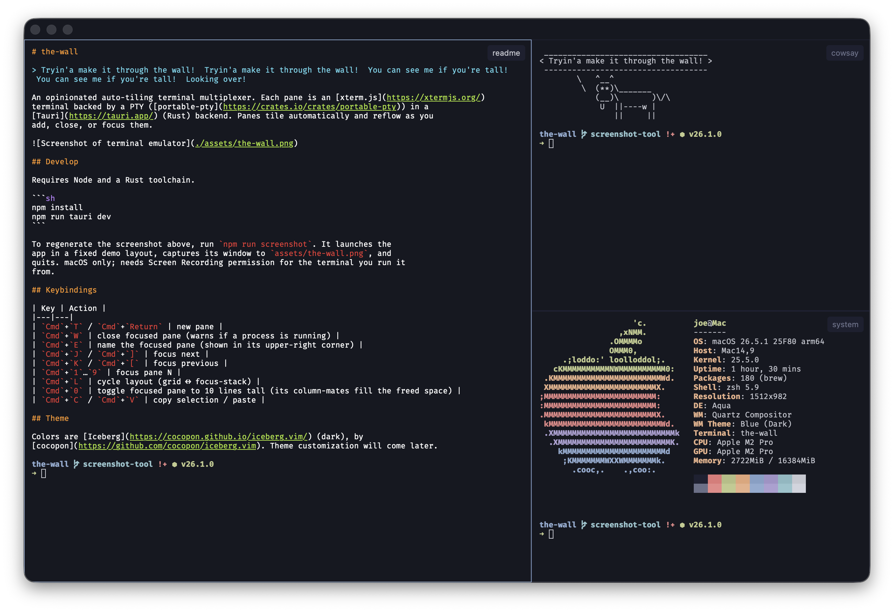

# the-wall

> Tryin'a make it through the wall!  Tryin'a make it through the wall!  You can see me if you're tall!  You can see me if you're tall!  Looking over!

An opinionated auto-tiling terminal multiplexer. Each pane is an [xterm.js](https://xtermjs.org/)
terminal backed by a PTY ([portable-pty](https://crates.io/crates/portable-pty)) in a
[Tauri](https://tauri.app/) (Rust) backend. Panes tile automatically and reflow as you
add, close, or focus them.



## Develop

Requires Node and a Rust toolchain.

```sh
npm install
npm run tauri dev
```

To regenerate the screenshot above, run `npm run screenshot`. It launches the
app in a fixed demo layout, captures its window to `assets/the-wall.png`, and
quits. macOS only; needs Screen Recording permission for the terminal you run it
from.

## Keybindings

| Key | Action |
|---|---|
| `Cmd`+`T` / `Cmd`+`Return` | new pane |
| `Cmd`+`W` | close focused pane (warns if a process is running) |
| `Cmd`+`E` | name the focused pane (shown in its upper-right corner) |
| `Cmd`+`J` / `Cmd`+`]` | focus next |
| `Cmd`+`K` / `Cmd`+`[` | focus previous |
| `Cmd`+`1`…`9` | focus pane N |
| `Cmd`+`L` | cycle layout (grid ↔ focus-stack) |
| `Cmd`+`0` | toggle focused pane to 10 lines tall (its column-mates fill the freed space) |
| `Cmd`+`C` / `Cmd`+`V` | copy selection / paste |

## Theme

Colors are [Iceberg](https://cocopon.github.io/iceberg.vim/) (dark), by
[cocopon](https://github.com/cocopon/iceberg.vim). Theme customization will come later.
